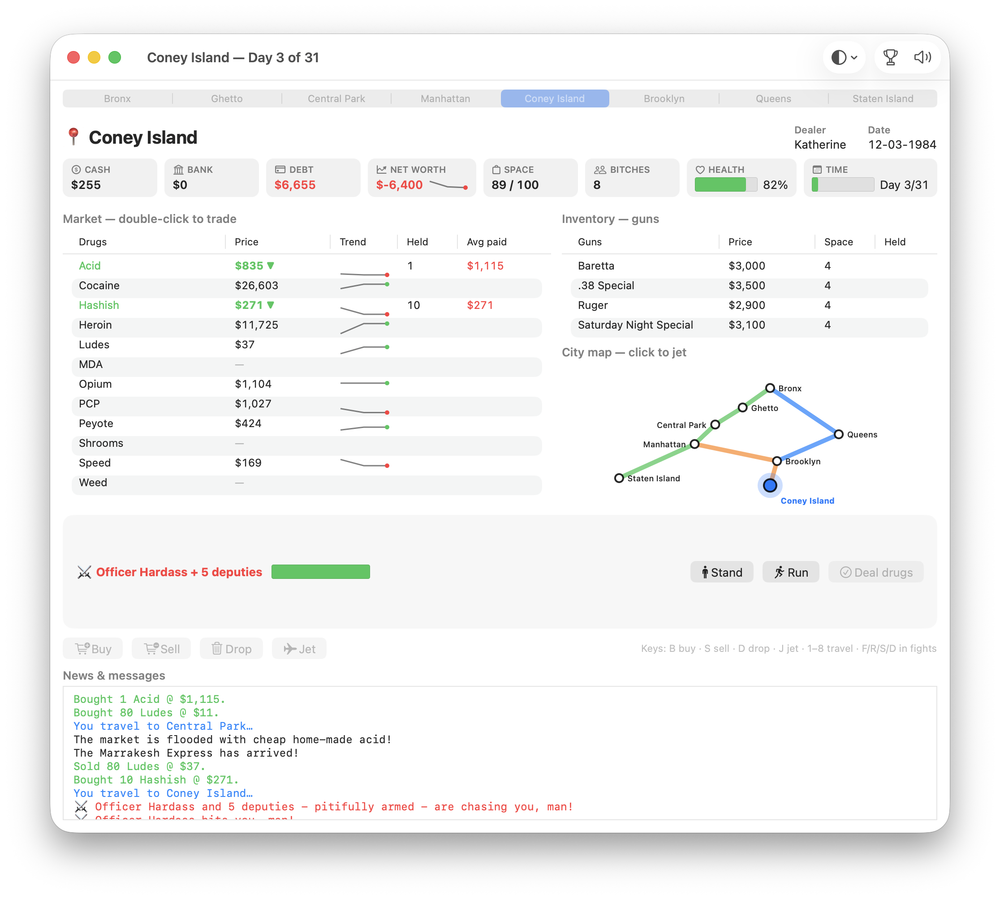

# Dope Wars for macOS (native AppKit port)



A standalone macOS application that plays **dopewars** with a native Cocoa
(AppKit) user interface — no GTK, no X11, no Terminal. It reuses the original
dopewars C game engine unchanged, driven in-process as a single-player game.

## What this is

The stock dopewars ships a GTK+ graphical client and an (n)curses terminal
client. This port adds a third front-end that is genuinely native to macOS:

- **`macos/config.h`** — a hand-written build configuration that compiles the
  engine with **no networking, curses, or GTK**, so it runs as a purely
  in-process single-player client+server.
- **`macos/bridge/`** — a thin C bridge (`dpbridge.c/.h`) that starts a
  single-player game, registers the engine's `ClientMessageHandlerPt`
  callback, decodes server→client protocol messages into simple structured
  events, and exposes clean read accessors and action senders. No glib types
  leak across this boundary, so it imports cleanly into Swift via
  `module.modulemap`.
- **`macos/DopewarsApp/`** — the native UI in Swift/AppKit:
  - `GameEngine.swift` — Swift wrapper over the C bridge (state + events).
  - `Views.swift` — stat tiles (SF Symbols, delta flash/shake, floating
    damage numbers), price-trend sparklines, the end-of-run net-worth
    chart, in-window welcome screen (remembers your dealer name, confetti
    on a high score), and the subway-map travel overlay with an animated
    train riding the route.
  - `MapView.swift` — the NYC subway map: stations in rough geography,
    three colored lines, route-finding, current/origin highlighting;
    doubles as the always-on sidebar mini-map and the click-to-jet picker.
  - `GameWindowController.swift` — main window: unified toolbar
    (appearance selector, high scores, mute), one-click location strip,
    stat-tile header (cash/bank/debt/net-worth + sparkline, health bar,
    day-countdown bar with a last-day alarm), sortable drug market with
    price-event highlighting (▼ cheap / ▲ spike), trend and average-paid
    columns, right-click Buy Max/Sell All menus, inventory table, inline
    question prompt bar (with attention flash), animated fight HUD
    (opponent name/escort/health, eased damage), Buy/Sell/Drop/Jet
    buttons, news log, and keyboard shortcuts (B/S/D/J, 1–8 to travel,
    F/R/S/D in fights, Y/N for prompts).
  - `Dialogs.swift` — Preferences (market-intel toggles and game-rule
    overrides — difficulty preset, game length, starting cash/debt,
    interest rates, price spike/crash size, armor, escort economics,
    start date, sanitized events, family-friendly wording — applied at
    the next new game — and the currency symbol/position, which applies
    immediately), trade popover, gun shop / bank / loan shark
    sheets, high-scores window, and the map-based location picker (also
    used when fleeing a fight).
  - `AppDelegate.swift` / `main.swift` — app bootstrap, full menu bar
    (Preferences, appearance override, Edit/Window menus, Mute Sound,
    standard About panel).

Questions and fights are inline panels in the main window; the bank, loan
shark, and gun shop open as sheets. Sound effects play through the
engine's native Cocoa driver from WAVs bundled in Resources.

## Building

See **[BUILDING.md](BUILDING.md)** for full instructions, the test
harnesses, and troubleshooting. The short version — Xcode command-line
tools plus glib:

```sh
brew install glib pkg-config
cd macos
./build_app.sh
open "build/Dope Wars.app"
```

The build compiles the engine into `libdopewars_engine.a`, compiles and
links the Swift front-end, assembles the bundle, **bundles
glib/gettext/pcre2 into `Contents/Frameworks`** with `@rpath` rewrites so
the app runs on Macs without Homebrew, and ad-hoc code-signs the result.

## Notes

- High scores are stored in `~/Library/Application Support/Dopewars/`.
- Sound uses the engine's native Cocoa sound driver (`plugins/sound_cocoa.m`).
- This build is single-player only. The original networked multiplayer,
  metaserver, and AI-player features are intentionally compiled out; the
  cross-platform GTK/curses clients still provide those.
- Licensed under the GNU GPL, like the rest of dopewars.
